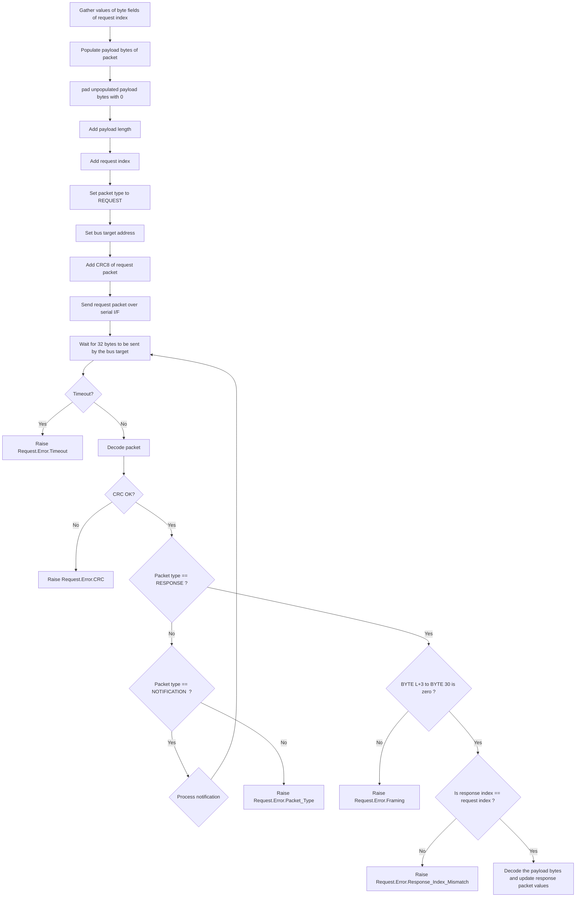
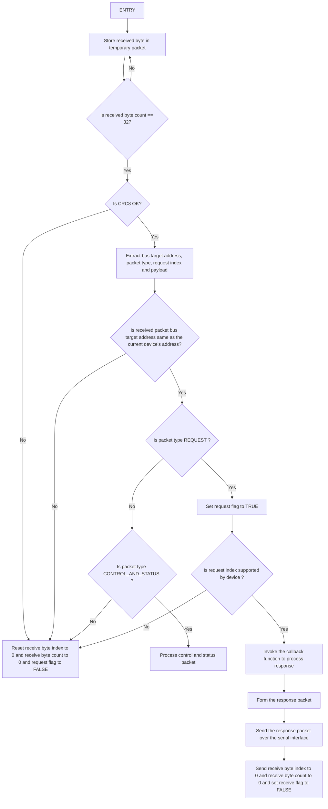

# serial-rpc
A simple serial remote procedure call protocol based on C for embedded systems. The base level protocol is the UART protocol. 
This protocol is a hybrid request-response/streaming protocol designed for single bus systems where multiple devices/systems 
are connected to a single bus. In the bus, there is exactly one master which sends out commands to a specific device along the 
bus and the device responds to the request. The bus master also has  control over the streaming of data by individual systems 
on the bus. The bus master can enable/disable streaming  of data from a certain bus target in order to avoid collision of bytes
on the system bus.

## Packet format
Each protocol packet consists of the following fields:

**address**:        This is the address of the bus target which is being addressed by the master or the address of the bus target
                    responding to a command or sending out a notification.

**packet_type**:    This indicates tha type of the packet. This protocol supports four types of packet: request(0), response(1),
                    notification(2) and control and status(3).
                
                    *Request*               :   This type of packet is sent by the bus master to a bus target of target *address*.
                    *Response*              :   This type of packet is sent by the bus target of target *address* to the bus master
                                                in response to the request packet sent by the bus master.
                    *Notification*          :   This type of packet is sent by the bus target of target *address* to the bus master.
                    *Control and status*    :   This is a special packet which is used to control the streaming of notifications by
                                                the target device and also get status of the bus target.

**index**:          This indicates the index of the request/response and the notification payload. In the bus master & target, the 
                    request/response packets are stored in a list and require the index to get the required request/response packet
                    from the list.

**payload_length**: The payload length indicates the number of bytes in the packet payload. The value of the payload length
                    ranges from 0 to 28 bytes.
                    
**crc**:            Each packet is protected by a CRC field which CRC8-CCITT [ref](https://www.3dbrew.org/wiki/CRC-8-CCITT). The CRC
                    field protects BYTE 0 to BYTE 30. The CRC byte is always written to BYTE 31 of the packet.

The request/response/notification packets have the following format:

|                                BYTE 0                                   |     BYTE 1      |      BYTE 2              |
|-------------------------------------------------------------------------|-----------------|--------------------------|
| Address(BIT7-BIT4) : Packet Type (BIT3 - BIT2) : INDEX_H (BIT1 - BIT0)  |     INDEX_L     |   PAYLOAD_LENGTH (**L**) |

|       BYTE 3 to BYTE L + 2        |    BYTE L + 3 to BYTE 30  |    BYTE 31    |
|-----------------------------------|---------------------------|---------------|
|    Payload bytes (length **L**)   |              0            |    CRC        |

The control and status packets have the following format:

|                                BYTE 0                             |          BYTE 1      |      BYTE 2               |
|-------------------------------------------------------------------|----------------------|---------------------------|
| Address(BIT7-BIT4) : Packet Type (BIT3 - BIT2) : 0 (BIT1 - BIT0)  | ENABLE_NOTIFICATIONS |  NOTIFICATION BUFFER SIZE |

|               BYTE 3         |      BYTE 4 to BYTE 30   |    BYTE 31   |
|------------------------------|--------------------------|--------------|
|   NOTIFICATION BUFFER COUNT  |             0            |      CRC     |

## Detailed software architecture

The bus master sends over a request packet over the bus to all devices. The devices on the bus receives the incoming byte and
calculates the target address. If the target address of the packet does not equal to the device's own address, the bus target device
rejects the incoming packet, else, processes it. If the incoming packet is a control/status packet, the device immediately sends out 
the response to the bus master. The bus target software then gets the request packet, extracts the payload and then uses the request packet
index to call the required callback function in the application code to process the request sent by the bus master. Once the request is
processed, the response packet is sent to the bus master. For sending over notifications, the target device checks if the bus master has 
enabled notifications or not. If enabled, the notification packet is loaded into the notification buffer which is then sent to the bus master.

### Processing of request and response by the bus master

The bus master maintains a list of values associated with a certain request index and another set of values associated with a
certain response index. When the host has to send out a request to a certain index, the host gathers the values associated with
the target index and forms the payload. Once the payload is formed, the payload length is appended and is then zero-padded.
The request index is then appended, followed by the bus target address and the CRC8 value for BYTE 0 to BYTE 30. The host sends out
the request packet to the bus and waits for the bus target to send 32 bytes. Once 32 bytes are received, the host performs CRC check,
framing check and packet type check. If all checks pass, the payload of the response packet is decoded and the values in the response list
of the host is updated.

### Processing of request and response by the bus target

The devices on the bus continuously read the bytes sent by the bus master. The device stores the received bytes
in a temporary buffer. Everytime a byte is being received, the receive byte count and the receive byte index
increments by one. Once the receive byte count is 32 bytes, the CRC of the received packet is calculated. If the
CRC of the received packet is not equal to zero, then, the receive byte count and the receive byte index is set
to zero. If the CRC of the received packet is equal to zero, then the packet is a valid packet. Next, the index,
packet type and the payload is extracted. If the packet type is not REQUEST and not CONTROL_AND_STATUS, the
receive byte index and the receive byte count is set to 0. If the received packet type is CONTROL_AND_STATUS, then,
the control and status word is processed. If the type of the received packet is REQUEST, then, set the request flag
to TRUE. Now, check of the request index is supported by the target device. If the request index is not supported,
set receive byte count and index to 0 and request flag to FALSE. If the request index is present in the device,
invoke the callback function to process the response, form the response packet and send the response over serial
interface. Once the response is sent, set receive byte count and index to 0 and request flag to FALSE.

